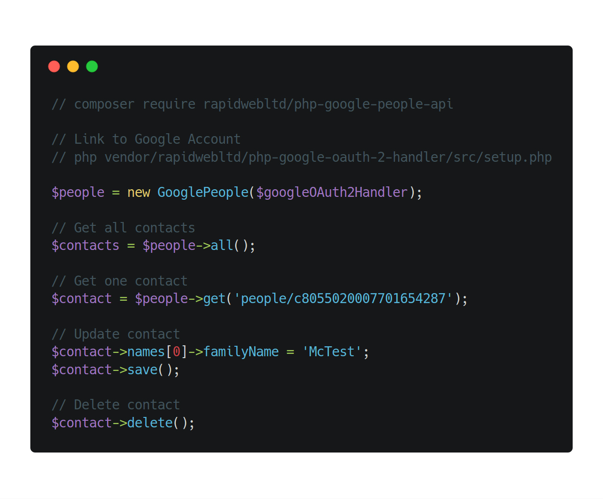

# 👥 PHP Google People API

This package provides a user friendly way of interacting with Google Contacts via the Google People API.



## Installation

PHP Google People API can be easily installed using Composer. Just run the following command from the root of your project.

```
composer require rapidwebltd/php-google-people-api
```

If you have never used the Composer dependency manager before, head to the [Composer website](https://getcomposer.org/) for more information on how to get started.

## Setup

To use this package, you need to authenticate with Google via OAuth 2. Thankfully, this is made easy by the PHP Google OAuth 2 Handler package.

You can run its guided setup script with the following command.

```
php vendor/rapidwebltd/php-google-oauth-2-handler/src/setup.php
```

This will guide you through the process of setting up a project, and logging into to the Google account that you wish to manage contacts for.
When asked which scopes you require access to, enter the following.

```
https://www.googleapis.com/auth/userinfo.profile
https://www.googleapis.com/auth/contacts
https://www.googleapis.com/auth/contacts.readonly
```

When complete, you will have to code you need to create a `GoogleOAuth2Handler` object for this Google account.

You can then create a `GooglePeople` object, as follows.

```php
$people = new GooglePeople($googleOAuth2Handler);
```

## Usage

### Retrieve all contacts

```php
// Retrieval all contacts
foreach($people->all() as $contact) {
    echo $contact->resourceName.' - ';
    if ($contact->names) {
        echo $contact->names[0]->displayName;
    }
    echo PHP_EOL;
}
```

### Retrieve a single contact

```php
// Retrieve single contact (by resource name)
$contact = $people->get('people/c8055020007701654287');
```

### Create a new contact

```php
// Create new contact
$contact = new Contact($people);
$contact->names[0] = new stdClass;
$contact->names[0]->givenName = 'Testy';
$contact->names[0]->familyName = 'McTest Test';
$contact->save();
```

### Update a contact

```php
// Update contact
$contact->names[0]->familyName = 'McTest';
$contact->save();
```

### Delete a contact

```php
// Delete contact
$contact->delete();
```
